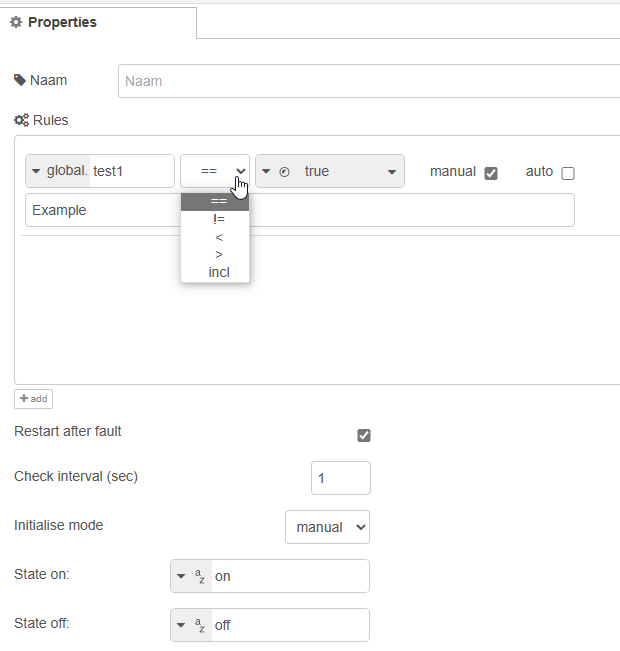

# Node-RED OperateLogic Node

This Node-RED project contains a custom Node-RED node called **"OperateLogic"** used for controlling a device based on logical rules and operation modes (`manual` or `automatic`) and commands (`start` or `stop`).

## Usage

The **"OperateLogic"** node can be configured via the Node-RED GUI. Drag the node into your flow and configure the settings as desired:

- **Check Interval**: Time interval (in seconds) for checking the rules.
- **Rules**: Logical rules to be evaluated on the given check interval.
- **Restart After Fault**: A new start command has to be given when checked. Unchecked it will automatically start again.
- **Initial Mode**: Initial operation mode (`manual` or `automatic`). Restarts of Node-RED will keep the mode in memory. This is only for a complete restart of your Node-RED system.
- **State On/Off**: The output command `"on"`/`"off"` can be modified to any boolean, string, or number.

All settings can be adjusted at any time and will immediately take effect.

## Operate Logic

### Mode Settings
Mode can be set if:
- `msg.mode = "manual"` or `"auto"`

### Start Commands
Start command in manual mode:
- `msg.manual = true` or `false` (boolean)

Start command in auto mode:
- `msg.auto = true` or `false` (boolean)

Stop commands will always be accepted. For example:
- In manual mode, you can give a stop command via `msg.manual`, but also a stop command via `msg.auto` will be accepted.
- In auto mode, you can give a stop command via `msg.auto`, but also a stop command via `msg.manual` will be accepted.

Start commands will not be accepted from opposite modes. For example:
- In manual mode, a start command from `msg.auto` will not be accepted.
- In auto mode, a start command from `msg.manual` will not be accepted.

You can change the mode to auto/manual only when the output/state is `"off"`.

## Rules

Rules can be added/removed. In these rules, you can check flow or global variables against string, number, boolean, flow variable, and global variable with operators. These operators are:
- `==`: equal
- `!=`: not equal
- `>`: greater
- `<`: less
- `incl`: includes

For every rule, you can choose in which mode it has to be checked or not checked.

Connect the **"OperateLogic"** node with other nodes in your Node-RED flow. Send messages to the node to change the operation mode (`manual` or `automatic`) and give `start`/`stop` commands as in the example below.
